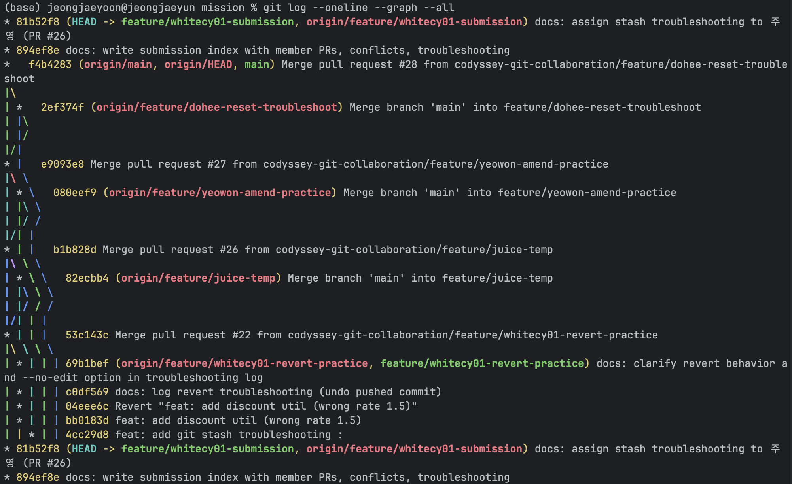
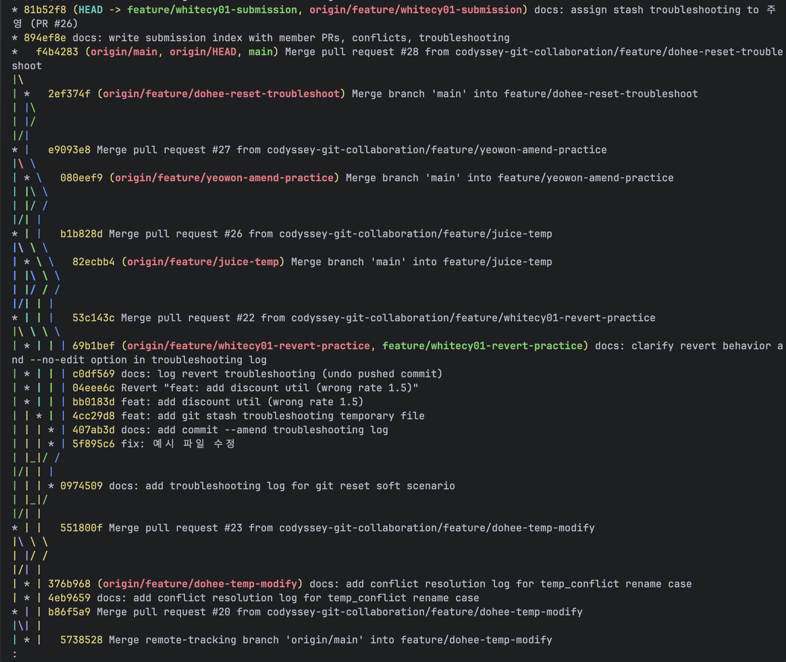
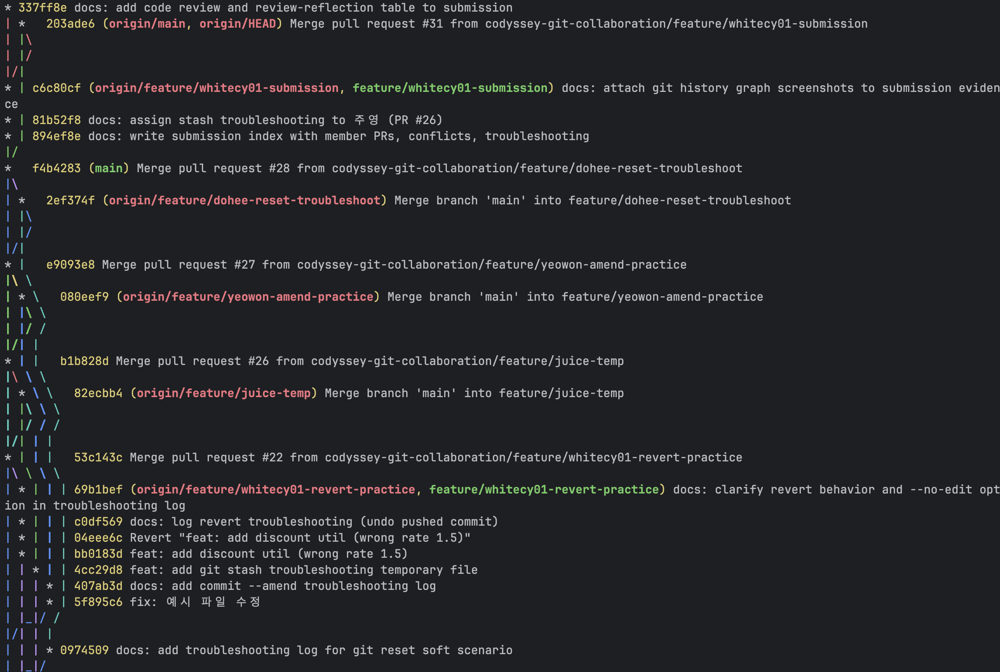
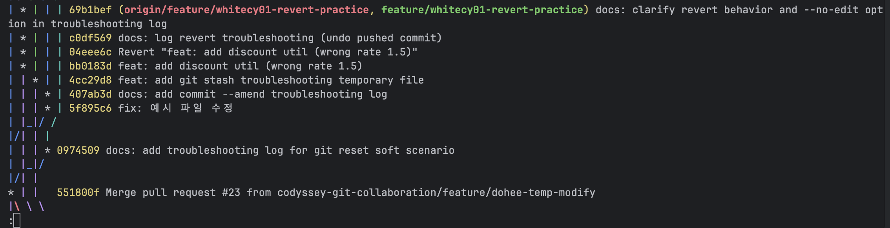

# Submission Index

제출물을 한 곳에서 확인할 수 있는 인덱스 문서입니다.

## Team
- 팀명: codyssey-git-collaboration
- 저장소: https://github.com/codyssey-git-collaboration/mission
- 팀원(GitHub): 재윤(@whitecy01), 주영(@juice), 도희(@dohee), 여원(@yeowon083)

## Member PRs

### 재윤 (@whitecy01)
- [#2 docs: add contributing guide](https://github.com/codyssey-git-collaboration/mission/pull/2)
- [#8 feat: add math utils (add, subtract, divide)](https://github.com/codyssey-git-collaboration/mission/pull/8)
- [#13 feat: add common_utils with team_info placeholder](https://github.com/codyssey-git-collaboration/mission/pull/13)
- [#15 feat: fill team_info with 재윤, 도희](https://github.com/codyssey-git-collaboration/mission/pull/15)
- [#22 docs: revert troubleshooting (undo pushed commit)](https://github.com/codyssey-git-collaboration/mission/pull/22)

### 주영 (@juice-devlog)
- [#6 feat: add string utility functions](https://github.com/codyssey-git-collaboration/mission/pull/6)
- [#14 refactor: rename temporary file](https://github.com/codyssey-git-collaboration/mission/pull/14)
- [#17 refactor: rename temporary file for the conflict](https://github.com/codyssey-git-collaboration/mission/pull/17)
- [#26 docs: revert troubleshooting (undo pushed commit)](https://github.com/codyssey-git-collaboration/mission/pull/26)

### 도희 (@dori943)
- [#4 feat: add list utils (first, last, length)](https://github.com/codyssey-git-collaboration/mission/pull/4)
- [#11 feat: add temp.py placeholder for conflict practice](https://github.com/codyssey-git-collaboration/mission/pull/11)
- [#20 feat: modify print message in temp.py for conflict test](https://github.com/codyssey-git-collaboration/mission/pull/20)
- [#23 feat : Modifying the Markdown file for conflict2 resolution practices.](https://github.com/codyssey-git-collaboration/mission/pull/23)
- [#28 docs: add troubleshooting log for git reset soft scenario](https://github.com/codyssey-git-collaboration/mission/pull/28)

### 여원 (@yeowon083)
- [#10 feat: 짝수 반환 함수, 제곱 반환 함수, 큰 값 반환 함수](https://github.com/codyssey-git-collaboration/mission/pull/10)
- [#16 feat: fill team_info with 주영, 여원 (resolve same-line conflict)](https://github.com/codyssey-git-collaboration/mission/pull/16)
- [#27 docs: git commit --amend 트러블슈팅 실습 기록](https://github.com/codyssey-git-collaboration/mission/pull/27)

> 각 PR 본문의 `Closes #<이슈번호>` 에서 연결된 이슈를 확인할 수 있습니다.

## Key Docs
- Contributing: [docs/CONTRIBUTING.md](docs/CONTRIBUTING.md)
- Conflict log: [docs/conflict-resolution.md](docs/conflict-resolution.md)
- Troubleshooting: [docs/troubleshooting-log.md](docs/troubleshooting-log.md)

## 간단한 결과물 (유틸 함수 모음)
- [src/math_utils.py](src/math_utils.py) — 재윤 (add, subtract, divide)
- [src/string_utils.py](src/string_utils.py) — 주영 (reverse, to_upper, to_lower)
- [src/list_utils.py](src/list_utils.py) — 도희
- [src/number_utils.py](src/number_utils.py) — 여원 (is_even, square, max_of_two)
- [src/common_utils.py](src/common_utils.py) — 팀 공용 (team_info)

## 충돌 해결 기록 (2회, 모두 비자명)
| # | 유형 | 참여자 | 관련 PR |
|---|------|--------|---------|
| 1 | 같은 파일 같은 줄(동일 hunk) 수정 | 재윤 ↔ 여원 | #15, #16 |
| 2 | 파일 rename ↔ 내용 수정 | 도희 ↔ 주영 | #20, #23 |

## 트러블슈팅 4종
| 시나리오 | 명령 | 담당 | PR |
|----------|------|------|-----|
| 최근 커밋 메시지 수정 | `git commit --amend` | 여원 | #27 |
| 로컬 커밋 취소 + 변경 유지 | `git reset --soft HEAD~1` | 도희 | #28 |
| 원격 push된 커밋 취소 | `git revert` | 재윤 | #22 |
| 작업 보관 후 전환 | `git stash` / `stash pop` | 주영 | #26 |

## 코드 리뷰 & 리뷰 반영
| 팀원 | 코드 리뷰 작성 (본인 PR 제외) | 본인 PR 리뷰 반영 |
|------|------------------------------|-------------------|
| 재윤 (@whitecy01) | [#10](https://github.com/codyssey-git-collaboration/mission/pull/10) (2건) | [#22](https://github.com/codyssey-git-collaboration/mission/pull/22) |
| 주영 (@juice-devlog) | [#4](https://github.com/codyssey-git-collaboration/mission/pull/4), [#8](https://github.com/codyssey-git-collaboration/mission/pull/8) | [#6](https://github.com/codyssey-git-collaboration/mission/pull/6) |
| 도희 (@dori943) | [#2](https://github.com/codyssey-git-collaboration/mission/pull/2), [#6](https://github.com/codyssey-git-collaboration/mission/pull/6) | [#4](https://github.com/codyssey-git-collaboration/mission/pull/4) |
| 여원 (@yeowon083) | [#22](https://github.com/codyssey-git-collaboration/mission/pull/22), [#26](https://github.com/codyssey-git-collaboration/mission/pull/26) | [#10](https://github.com/codyssey-git-collaboration/mission/pull/10) |

→ 전원 리뷰 2개 이상 작성 + 본인 PR에서 리뷰 반영 1회 이상 충족

## Evidence

`git log --oneline --graph --all` 결과 (PR 기반 병합 흐름 + 충돌 해결 머지 커밋 확인 가능)

